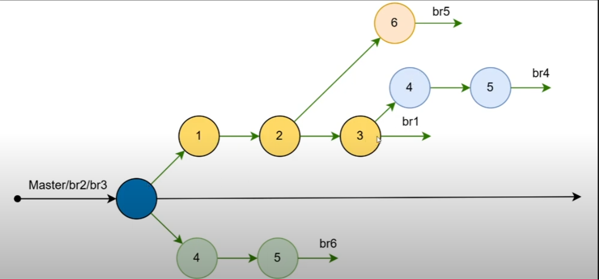

# GIT
<Toc/>

---

# GIT Ignore

<v-clicks>

- File dùng để chỉ định những file hoặc thư mục mà Git sẽ bỏ qua, không theo dõi sự thay đổi.
- Các trường hợp cần sử dụng .gitignore:
  - File tạm thời
  - Dữ liệu mật
  - File cấu hình riêng của từng môi trường
- Lưu ý: Tên file là .gitignore (bao gồm cả dấu `.`)
- Các bước tạo file `.gitignore`:
  1. Tạo file `.gitignore`
  2. Thêm các tệp và thư mục bỏ qua vào file
  3. Commit file `.gitignore` này
  4. Kiểm tra lại file `.gitignore` này đã hoạt động chưa

</v-clicks>

---

# Sử dụng .gitignore để loại bỏ các file .txt

```html
*.txt                     # ignore tất cả file có đuôi txt

abc.log                   # ignore file có tên abc.log

bin/                      # ignore thư mục bin
obj/                      # ignore thư mục obj
```
---

# GIT Branch
<v-clicks>

- là bản sao của toàn bộ dự án, cho phép phát triển và thử nghiệm tính năng mới mà không ảnh hưởng tới nhánh chính.
- Mỗi nhánh độc lập với nhau (không ảnh hưởng tới các nhánh khác), cho phép các developer làm việc đồng thời trên cùng một dự án
- Nhánh giúp quản lý và phân tách các tính năng của mỗi developer.
- Sau khi hoàn thành, các thay đổi từ các nhánh con có thể gộp vào nhánh chính.

</v-clicks>

---

# Tại sao brach (nhánh) quan trọng?

<v-clicks>

- Cho phép các developer làm việc 1 cách độc lập với các tính năng khác nhau mà không ảnh hưởng tới nhau.
- Giúp quản lý dự án và sửa lỗi dễ dàng hơn.

</v-clicks>

---


# Liệt kê

<v-clicks>

- `Default Branch (nhánh chính)`: khi tạo repository mới thì đây sẽ là branch mặc định tùy vào mình tạo có thể là master hoặc main
<br>
`Lưu ý:` nhánh này cần phải luôn duy trì trạng thái ổn định nhất của dự án.
- Để xem danh sách các nhánh có trong repository:
```html
PS A:\kich ban\git> git branch
* master                                                      # * được xem là định vị bạn đang ở nhánh nào
```

</v-clicks>

---

# Các lệnh cơ bản làm việc với nhánh

|                                                     |                             |
| --------------------------------------------------- | --------------------------- |
| git brach                                           | liệt kê tất cả branch trong repository     |
| git branch ten_nhanh | tạo mới một nhánh |
| git checkout ten_nhanh                                       | chuyển qua nhánh với ten_nhanh              |
| git branch -d ten_nhanh                                     | Xóa nhánh                  |
| git checkout -b ten_nhanh                                     | Tạo và chuyển tới nhánh có ten_nhanh                  |

---

# Ví dụ

<v-clicks>

1. Tạo nhánh mới có tên là new1

```html
git branch new1
```

2. Kiểm tra danh sách các nhánh

```html
git branch
```

3. Kết quả:

```html
PS A:\kich ban\git> git branch new1
PS A:\kich ban\git> git branch
* master
  new1
```

</v-clicks>

---

# Chuyển đổi Branch

<v-clicks>

1. Chuyển sang nhánh new1 bằng lệnh:

```html
git checkout new1
```

2. Kết quả:

```html
PS A:\kich ban\git> git checkout new1
Switched to branch 'new1'
PS A:\kich ban\git> git branch
  master
* new1
```

3. Hãy kiểm tra lại bằng lệnh:

```html
git branch
```

</v-clicks>

---

# Thực hành
1. Tạo file mới
2. Tạo repository
3. Tạo file gitignore
4. Tạo các file có các đuôi: txt, log.
5. Hãy commit file có tên là abc.log và git không thể theo dõi các file có đuổi txt

---

# Một vài lệnh khác:

<v-clicks>

- Tạo nhánh và chuyển sang nhánh đó ngay lập tức
```html
git checkout -b ten_nhanh
```

- Tạo nhánh từ commit hash cụ thể
```html
git checkout -b ten_nhanh a1b2c3d4
```

- Xóa nhánh đã tồn tại
```html
git branch -d ten_nhanh
```

- Xóa 1 nhánh có commit chưa gộp code vào nhánh chính
```html
git branch -D ten_nhanh
```

</v-clicks>

---

# Giới thiệu git graph trên vs code

---

# Quy tắc đặt tên nhánh

- Quy tắc đặt tên nhánh trên Git giúp duy trì cấu trúc và dễ hiểu cho dự án

<v-clicks>

1. `Ngắn gọn`: Tên nhánh ngắn gọn và mô tả rõ mục đích của nó.
2. `Rõ ràng`: Tên nhánh nên mô tả rõ ràng về nhiệm vụ hoặc tính năng đang phát triển
3. `Tránh kí tự đặc biệt`: Hạn chế sử dụng các kí tự đặc biệt trong tên nhánh để tránh xung đột khi làm việc trên các hệ thống khác nhau
4. `Phân cách bằng dấu gạch ngang hoặc dấu gạch dưới`: Sử dụng `dấu gạch ngang` hoặc `dấu gạch dưới` để phân cách các tên nhánh

</v-clicks>

---
dragPos:
  square: 59,143,888,381
---

# Thực hành

- Tạo repository và thực hiện tạo nhánh sao cho lịch sử như hình. (mỗi nhánh tạo ra 1 file text mới).


